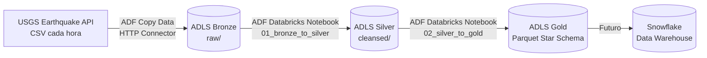

# ETL Earthquake — Azure

Migración del proyecto `etl-earthquake-aws` a Azure usando Terraform + ADF + Databricks.

## Arquitectura



## Stack

| Capa | Tecnología |
|------|-----------|
| Infraestructura | Terraform (AzureRM + Databricks providers) |
| Almacenamiento | Azure Data Lake Storage Gen2 (ADLS) |
| Orquestación | Azure Data Factory |
| Transformación | Databricks (PySpark / Delta Lake) |
| CI/CD | GitHub Actions |

## Estructura

```
etl-earthquake-azure/
├── terraform/                     # Infraestructura como código
│   ├── main.tf                    # Providers + Resource Group
│   ├── storage.tf                 # ADLS Gen2 + containers
│   ├── databricks.tf              # Workspace + cluster + notebooks
│   ├── datafactory.tf             # Data Factory + RBAC
│   └── variables.tf               # Variables de entorno
│
├── databricks/                    # Notebooks PySpark
│   ├── 01_bronze_to_silver.py     # Flatten, clean, dedup, enrich
│   └── 02_silver_to_gold.py       # Star Schema dimensional
│
├── .github/workflows/
│   └── deploy.yml                 # Terraform apply on push
│
├── plan.md                        # Plan de implementación
└── README.md                      # Este archivo
```

## Data Flow

1. **Bronze**: ADF copia CSV de USGS Earthquake API → ADLS `/bronze/raw/`
2. **Silver**: Databricks notebook flattrea GeoJSON, castea tipos, valida rangos, deduplica por `event_id`, enriquece con features (categorías de magnitud/profundidad, hemisferios, país extraído) → ADLS `/silver/cleansed/` en formato Delta
3. **Gold**: Databricks notebook construye Star Schema dimensional:
   - `dim_date` — calendario con atributos (año, trimestre, mes, día, fin de semana)
   - `dim_location` — ubicaciones únicas con país/región/hemisferio
   - `dim_magnitude` — categorías estáticas (Micro → Great)
   - `dim_event_type` — tipos de evento + magType
   - `fact_earthquake_events` — medidas (magnitud, profundidad, tsunami, etc.)

## Prerequisitos

- Cuenta Azure con suscripción activa ([free tier](https://azure.microsoft.com/free))
- Terraform >= 1.5
- GitHub Secrets configurados:
  - `ARM_CLIENT_ID`
  - `ARM_CLIENT_SECRET`
  - `ARM_TENANT_ID`
  - `ARM_SUBSCRIPTION_ID`
  - `DATABRICKS_TOKEN` — Crear en Databricks UI → User Settings → Access Tokens → Generate New Token. Guardar en GitHub Secrets del repositorio.

> **Nota:** `DATABRICKS_TOKEN` es necesario para el ADF Linked Service a Databricks. El Service Principal en los providers AzureRM y Databricks usa `ARM_CLIENT_ID`, `ARM_CLIENT_SECRET`, `ARM_TENANT_ID`.

## State Storage Bootstrap (manual, una sola vez)

Antes del primer `terraform apply` en CI, crear el storage account para el estado remoto:

```bash
az storage account create \
  --resource-group rg-terraform-state \
  --name satearthquakeetltfstate \
  --sku Standard_LRS \
  --allow-blob-public-access false

az storage container create \
  --account-name satearthquakeetltfstate \
  --name tfstate
```

El backend `azurerm` en `main.tf` usa estos valores por defecto. En CI se sobrescriben vía `-backend-config`.

## Deploy

```bash
cd terraform
terraform init
terraform plan -var-file="dev.tfvars"
terraform apply -var-file="dev.tfvars"
```

## Configuración post-deploy (ADF Studio)

1. Crear Linked Service a ADLS (Managed Identity)
2. Crear Linked Service a Databricks (PAT token)
3. Crear pipeline `PL_MasterPipeline`:
   - Copy Data (HTTP USGS → ADLS bronze/)
   - Databricks Notebook (01_bronze_to_silver)
   - Databricks Notebook (02_silver_to_gold)
4. Crear Trigger Schedule cada 6h
5. Conectar Git al repositorio

## Licencia

MIT
